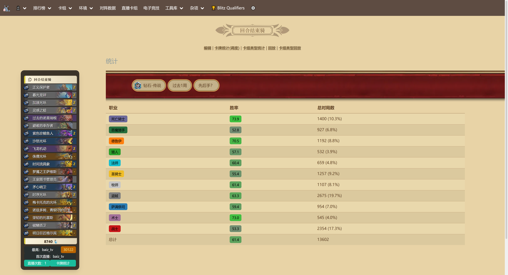
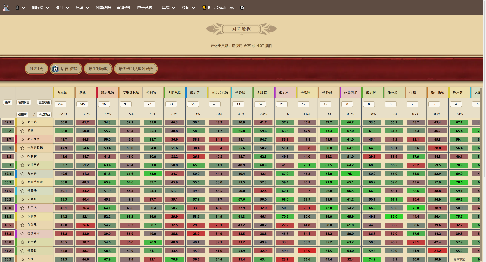
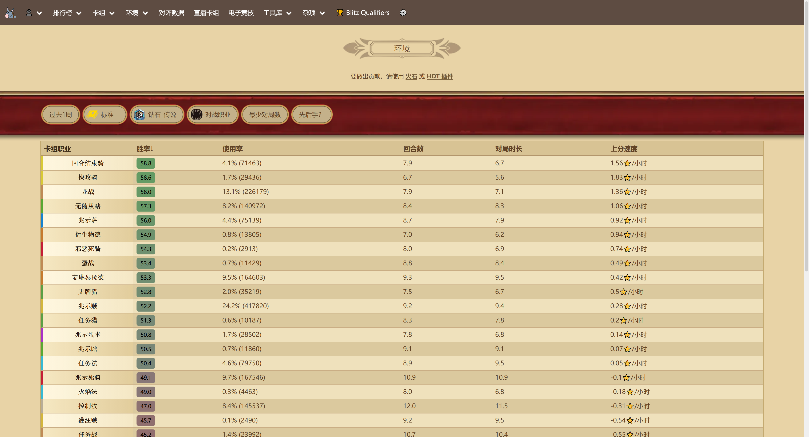
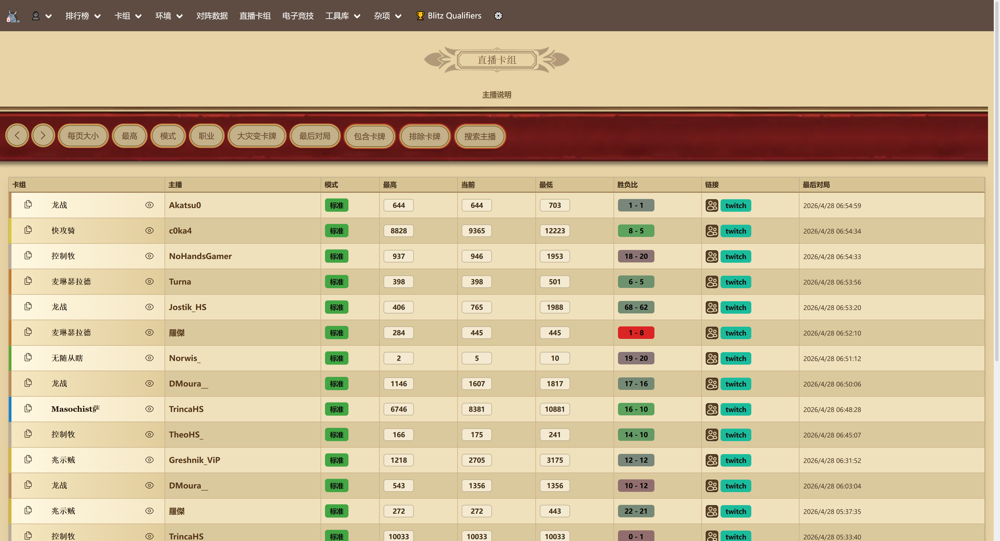
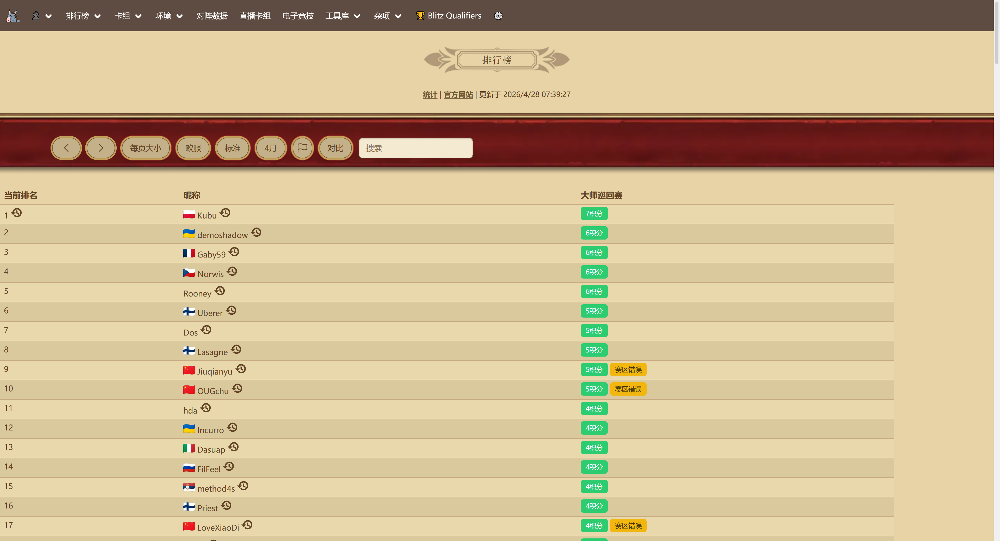
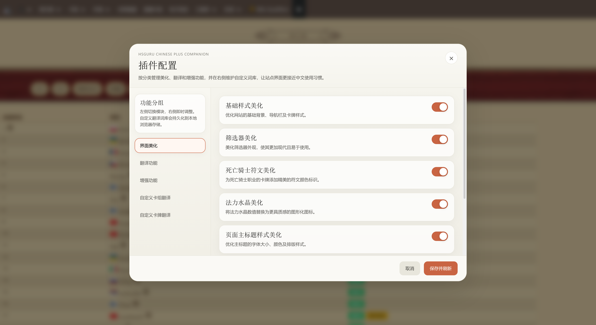
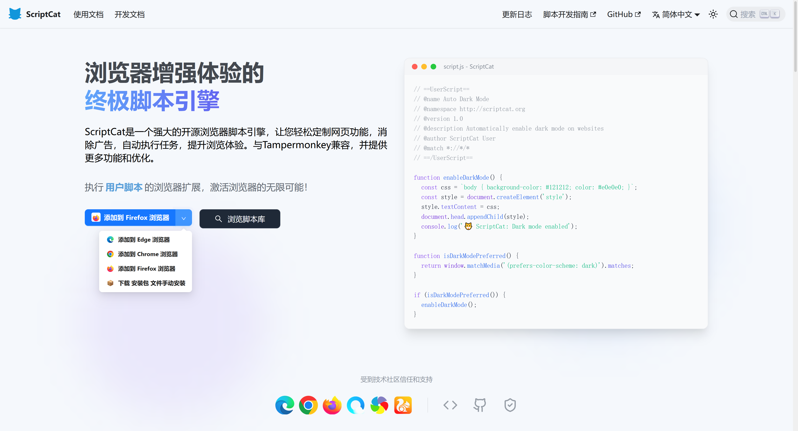
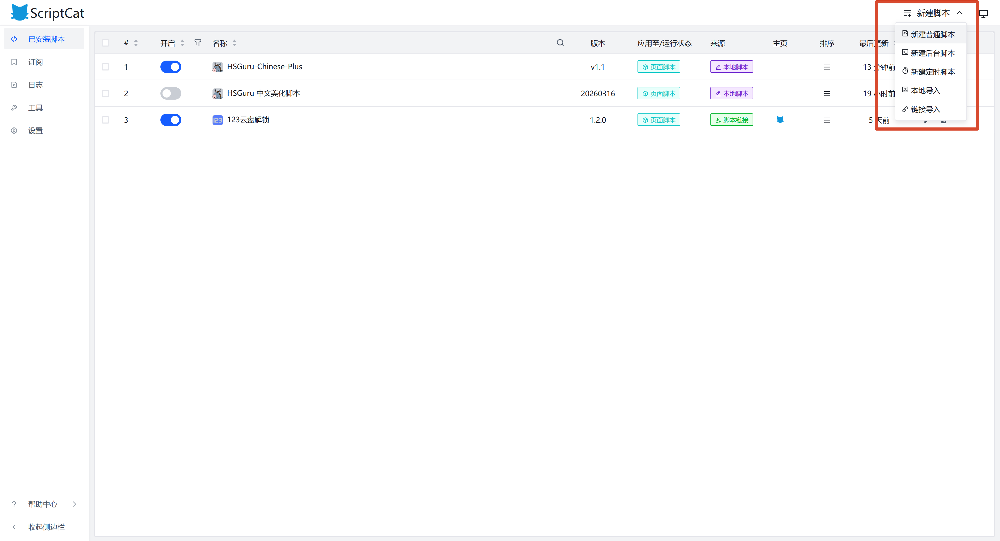

# HSGuru-Chinese-Plus

> 当前版本：v2.1.0

---

## 📌 项目简介

HSGuru-Chinese-Plus 是一款 ScriptCat / Tampermonkey 用户脚本，适用于 [HSGuru](https://www.hsguru.com/)（炉石传说数据统计网站）。

该脚本提供以下能力：

- 网站界面文本中文化
- 页面样式优化与视觉增强
- 卡组与卡牌信息翻译
- 本地缓存与自定义配置支持

本项目基于原作者 NGA-\***\*深海之鱼\*\*** 的 [hsguru-chinese](https://bbs.nga.cn/read.php?tid=46381451) 版本进行二次开发，在保留原有翻译与美化能力的基础上，扩展了页面覆盖范围、增强了卡组/卡牌翻译管理、优化了表格视觉呈现，并新增了配置面板、自定义词库、缓存队列和多页面美化规则等功能。

---

## 🖼️ 效果展示

### 脚本效果截图

|                    首页                    |                卡组列表                 |
| :----------------------------------------: | :-------------------------------------: |
|         |  |
| 首页 Omni Bar 搜索、卡组卡片中文翻译与美化 | 卡组列表页筛选栏、卡组名翻译与表格美化  |

|                    卡组详情                     |                  对阵统计                   |
| :---------------------------------------------: | :-----------------------------------------: |
|  |  |
|  卡组详情页副标题导航、法力水晶图标与卡牌翻译   |        对阵统计页表格美化与职业配色         |

|                环境分析                 |                     主播卡组                      |
| :-------------------------------------: | :-----------------------------------------------: |
|  |  |
|    环境分析页表格翻译与职业色左边框     |            主播卡组列表翻译与表格美化             |

|                排行榜                 |                 配置面板                 |
| :-----------------------------------: | :--------------------------------------: |
|  |  |
|  排行榜筛选栏、搜索框与翻页按钮美化   |      配置弹窗：功能开关、自定义翻译      |

---

## 🚀 快速开始

### 环境要求

- 浏览器：Chrome / Edge / Firefox
- 脚本管理器：
  - ScriptCat（推荐）
  - Tampermonkey

---

### 从 Release 下载

前往 [Releases](../../releases) 页面，下载最新版本的 `hsguru-chinese-plus.js`，在脚本管理器中新建脚本并粘贴内容即可。

---

### 安装步骤（以 ScriptCat 为例）

1. 安装 ScriptCat 扩展  
   

2. 新建脚本  
   

3. 导入 `hsguru-chinese-plus.js` 并保存

4. 访问网站：  
   https://www.hsguru.com/

---

## 🔨 构建说明

### 开发环境

- **Node.js** >= 18
- **npm** >= 9

### 安装依赖

```bash
npm install
```

### 开发模式

启动 Vite 开发服务器，支持热更新：

```bash
pnpm run dev
```

### 构建打包

执行 TypeScript 类型检查 + Vite 构建，产物输出到 `dist/` 目录：

```bash
pnpm run build
```

构建产物为 `dist/hsguru-chinese-plus.js`，可直接导入脚本管理器使用。

### 项目结构

```
src/
├── main.ts                    # 入口：初始化、Observer、事件监听
├── features/                  # 功能模块
│   ├── cardTranslation.ts     # 卡牌名称翻译
│   ├── cardPreview.ts         # 卡牌悬浮预览
│   ├── deckTranslation.ts     # 卡组名称翻译
│   ├── configModal.ts         # 配置面板
│   └── ...
├── utils/                     # 工具模块
│   ├── api.ts                 # API 请求队列管理
│   ├── translationCache.ts    # 翻译缓存（LRU + localStorage）
│   ├── storage.ts             # 分层存储管理器
│   ├── constants.ts           # 常量定义
│   └── ...
└── types/                     # 类型声明
    └── index.d.ts
```

### 版本发布

推送 `v*` 格式的 tag 即可自动触发 GitHub Actions 构建并发布 Release：

```bash
# 更新 vite.config.ts 中的 version 后
git tag v2.1.0
git push origin v2.1.0
```

---

## 🧭 使用说明

### 自动生效

安装后访问 HSGuru 即可自动生效：

- UI 自动翻译
- 卡组 / 卡牌翻译
- 页面样式优化
- 广告隐藏

---

### ⚙️ 配置面板

点击导航栏 ⚙️ 按钮可打开：

- 功能开关（界面 / 翻译 / 增强）
- 自定义卡组翻译
- 自定义卡牌翻译

---

### 💾 数据存储

| 存储键                     | 说明           |
| -------------------------- | -------------- |
| `hsguru_config`            | 功能配置       |
| `hsguru_custom_deck_names` | 自定义卡组翻译 |
| `hsguru_custom_card_names` | 自定义卡牌翻译 |
| `hsguru_card_*`            | 卡牌翻译缓存   |
| `hsguru_card_image_*`      | 卡牌图片缓存   |

---

## ✨ 功能特性（Features）

### 🎨 界面处理

- 页面基础样式优化（背景 / 导航 / 卡片）
- 筛选器与排行榜 UI 调整
- 表格优化（斑马纹 / 行距 / 职业色）
- 法力水晶图标替换
- 死亡骑士符文样式增强
- 标题与排版优化

---

### 🌐 翻译处理

- UI 文本翻译（导航 / 按钮 / 表头等）
- 卡组名称自动翻译（支持规则与自定义）
- 卡牌名称翻译（API + 多级缓存）
- Omni Bar / 排行榜 / 标签翻译
- 页面标题与表格翻译

---

### ⚡ 功能扩展

- 广告移除
- 卡牌悬浮中文预览
- 卡组复制增强
- 返回顶部按钮
- 职业配色系统
- 移除卡牌跳转链接

---

### 📄 页面支持

| 页面路由                        | 翻译 | 美化 |
| ------------------------------- | ---- | ---- |
| `/decks`                        | ✅   | ✅   |
| `/meta`                         | ✅   | ✅   |
| `/matchups`                     | ✅   | ✅   |
| `/leaderboard`                  | ✅   | ✅   |
| `/leaderboard/points`           | ✅   | ✅   |
| `/leaderboard/player-stats`     | ✅   | ✅   |
| `/leaderboard/rank-history/*`   | ✅   | ✅   |
| `/leaderboard/player-history/*` | ✅   | ✅   |
| `/streamer-decks`               | ✅   | ✅   |
| `/deck/<id>`                    | ✅   | ✅   |
| `/card/<id>`                    | ✅   | ✅   |
| `/card-stats`                   | ✅   | ✅   |
| `/cards`                        | ✅   | —    |
| `/esports`                      | ✅   | —    |

---

## 🔧 实现细节（Implementation）


### 🌐 翻译策略

1. 静态映射（staticPrefix）
2. 符文组合生成
3. 用户自定义翻译
4. 动态生成

---

### ⚡ 缓存机制

多层缓存策略：

- 内存缓存
- localStorage 持久化
- API 回退机制

---

### 🗂️ 缓存结构

- translationCache（LRU）
- queryCache（WeakMap）
- cardCache
- cardImageCache
- staticPrefix

---

## 🧠 技术特点

- MutationObserver 动态响应
- 幂等保护机制
- 请求队列与并发控制
- 多级缓存架构
- 配置持久化

---

## 🤝 贡献指南

### Bug 反馈

请提交 Issue，并附带：

- 浏览器信息
- 页面 URL
- 复现步骤
- 控制台日志

---

### 功能建议

欢迎提交 Issue 说明需求与使用场景。

---

### 代码规范

- 保持与现有代码风格一致
- 新增功能需在 `FEATURES` 对象中注册，包含 `name`、`category`、`description`
- 所有 DOM 注入操作必须做幂等保护（通过 dataset 或 ID 检查防止重复执行）
- 新增翻译条目请添加到 `uiTranslations`、`staticPrefix` 或 `classSuffix` 中

### Pull Request

1. Fork 项目
2. 创建分支
3. 提交修改
4. 发起 PR

---

## 📄 许可证

本项目基于 [MIT License](https://opensource.org/licenses/MIT) 开源。

---

## 🙏 致谢

- \***\*深海之鱼\*\*** — 原版脚本作者，为本项目奠定了完整的翻译框架与美化基础（[NGA 帖子](https://bbs.nga.cn/read.php?tid=46381451)）
- [旅法师营地](https://www.iyingdi.com/) — 提供卡牌中文名称查询 API（`api2.iyingdi.com`）
- [HSGuru](https://www.hsguru.com/) — 优秀的炉石传说数据统计平台

---

## 📌 TODO

- [ ] deckviewer 页面美化
- [ ] deckbuilder 页面美化
- [ ] cards 页面美化
